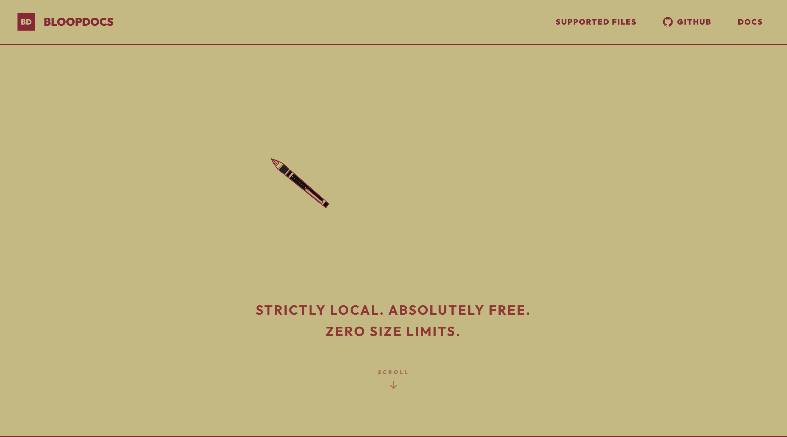
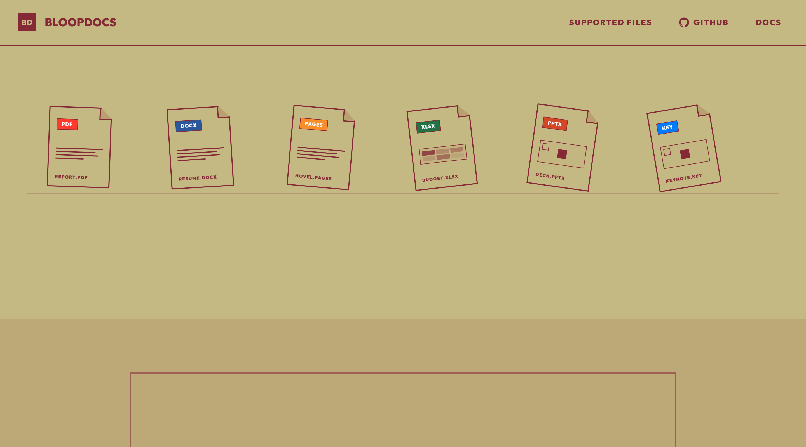
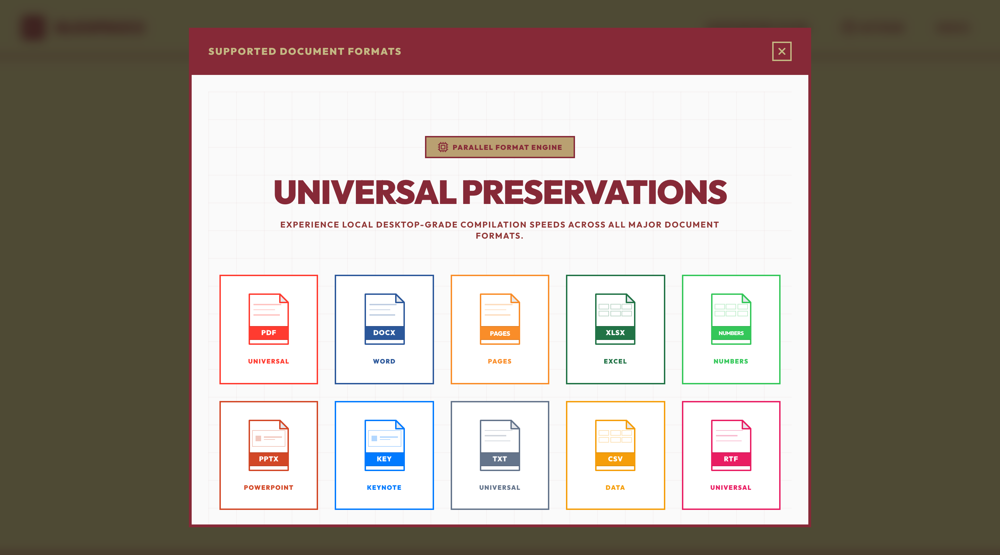

<div align="center">
  <h1>BloopDocs 📂</h1>
  <p><strong>A high-performance, secure, and completely free document conversion platform built on Next.js 16 and powered by a headless LibreOffice engine.</strong></p>

  <a href="https://godrick7-bloopdocs.hf.space">
    
  </a>
  
  
</div>

<br />

> 🌍 **Convert your documents instantly at: [godrick7-bloopdocs.hf.space](https://godrick7-bloopdocs.hf.space)**

---

## 📸 Immersive Interface

Experience an ultra-premium Brutalist design with dynamic HSL color-coded cards and beautiful typography.

<div align="center">
  <h3>The Interface</h3>
  
  <br/><br/>
  <h3>Conversion Dashboard</h3>
  
  <br/><br/>
  <h3>Supported Formats</h3>
  
</div>

---

## ✨ Features

- **Seamless Document Conversions**: Convert files between Word/Pages (`.docx`, `.pages`), Excel/Numbers (`.xlsx`, `.numbers`), PowerPoint/Keynote (`.pptx`, `.keynote`), and PDF (`.pdf`) format seamlessly.
- **Ultra-Premium Brutalist Design**: Experience a gorgeous visual interface featuring dynamic HSL color-coded document cards, exact 3D folded-paper SVG paths, interactive hover states, beautiful unmasked cursive typography, and customized interactive overlay portals.
- **Header Navigation Modals**: Supported formats and detailed system architecture documentation are rendered on-demand in smooth, bouncing modal overlays (`BrutalistModal`), keeping the main landing page sleek and focused.
- **100% Secure & Ephemeral**: All document conversions are processed locally on isolated, system-controlled temp directories and completely wiped from the server container cache immediately after compile. No files are ever saved or tracked.
- **Free-of-Cost (0 USD/month) Hosting**: Engineered to build and run perfectly within Hugging Face Spaces' CPU-basic limits using an optimized Docker multi-stage environment.

---

## 🛠️ Technology Stack

| Category | Technology |
|---|---|
| **Framework** | Next.js 16 (Turbopack) & React 19 |
| **Aesthetics & Motion** | Tailwind CSS v4, Vanilla CSS, GSAP, Canvas Confetti, Custom SVGs |
| **Backend Processor** | Headless LibreOffice (`soffice` v20+) |
| **Packaging** | Docker, Bullseye Linux, JSZip |

---

## ⚙️ How It Works (Backend Engine Architecture)

The system automatically detects the hosting operating system environment (`darwin` for macOS development or `linux` for Docker Space containers) and spawns an isolated headless command process:

```bash
"soffice" -env:UserInstallation=file://[temp_profile] --headless --convert-to [target_ext] [file_path] --outdir [out_dir]
```
- **`-env:UserInstallation`**: Configures a dynamic unique session user profile for each conversion, preventing file read/write locks and allowing multiple concurrent conversion requests without resource crashes.
- **Multi-File Batching**: Converts several documents concurrently and compiles them instantly into a single high-compression ZIP package download.

---

## 🚀 Local Development Setup

### Prerequisites
1. **Node.js**: `v20.9.0` or higher (required by Next.js 16)
2. **LibreOffice**: Install [LibreOffice](https://www.libreoffice.org/download/download-libreoffice/) on your system and ensure `soffice` is in your environment binary path (or located in the default `/Applications/LibreOffice.app/` path on macOS).

### Installation

1. **Clone the repository**:
   ```bash
   git clone https://github.com/7-Bala/BloopDocs.git
   cd BloopDocs
   ```

2. **Install dependencies**:
   ```bash
   npm install
   ```

3. **Start the local development server**:
   ```bash
   npm run dev
   ```
   Open **[http://localhost:3000](http://localhost:3000)** in your browser to interact with the app.

4. **Verify local build production**:
   ```bash
   npm run build
   ```

---

## 🐳 Docker Container & Cloud Deployment

BloopDocs is packaged using a multi-stage Docker configuration that installs all required fonts and LibreOffice CLI utilities:

```bash
# Build the Docker image
docker build -t bloopdocs .

# Run the container locally (binds to port 7860)
docker run -p 7860:7860 bloopdocs
```

---

### 💖 Developed by think2thrive
<p align="center">
  <i>Designed with passion to make document utilities beautiful, responsive, and completely accessible to everyone without paid subscriptions.</i>
</p>
